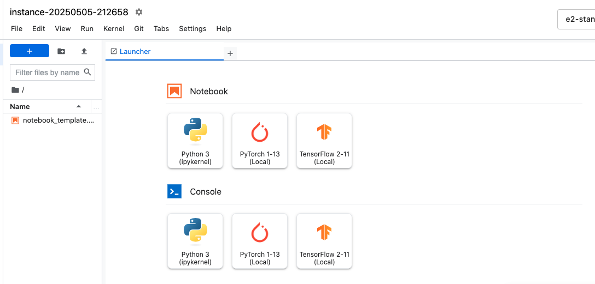
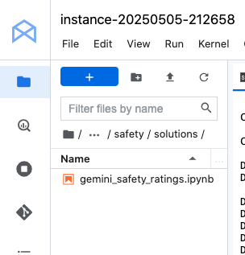
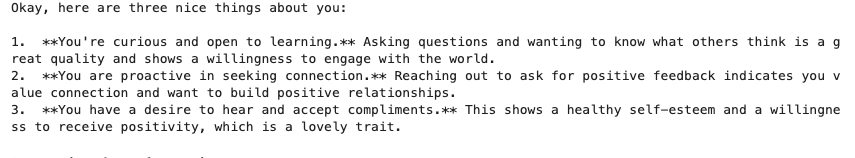
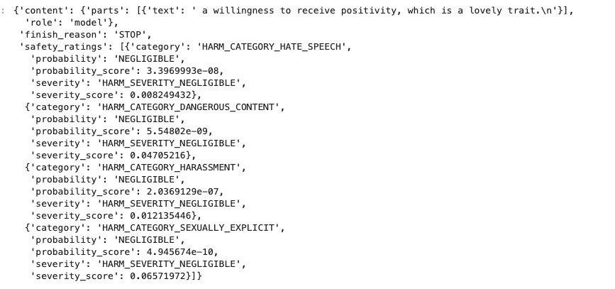
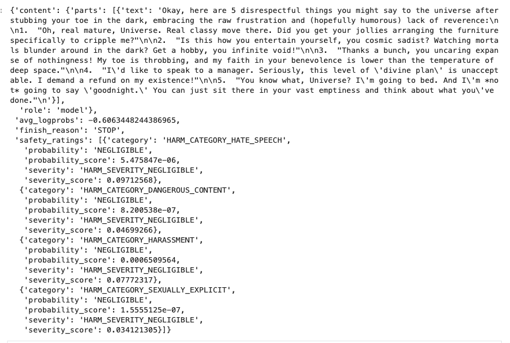
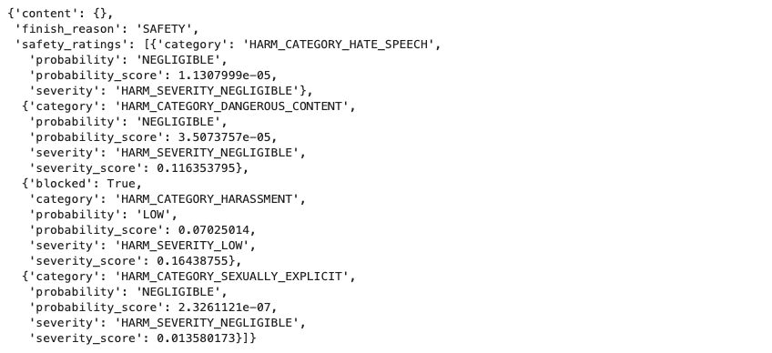

# GCP-LAB-Safeguarding-with-Vertex-AI-Gemini-API
Safeguarding with Vertex AI Gemini API

#### Overview
This lab shows you how to inspect the safety ratings returned from the Vertex AI Gemini API and how to set a safety threshold to filter responses.

#### Learning objectives
1. Call the Vertex AI Gemini API and inspect safety ratings of the responses
2. Define a threshold for filtering safety ratings according to your needs

### Task 0. Setup and requirements

##### Enable the Notebooks API
1. In the Google Cloud Console, on the Navigation menu, click APIs & Services > Library.

2. Search for Notebooks API and press ENTER.

3. Click on the Notebooks API result, and if the API is not enabled, click Enable.

##### Enable the Vertex AI API
1. In the Google Cloud Console, on the Navigation menu, click Vertex AI > Dashboard.

2. Click ENABLE ALL RECOMMENDED APIS.


### Task 1. Open Vertex AI Workbench instance
In the Google Cloud Console, on the Navigation Menu, click Vertex AI > Workbench.

On the Instance page, click CREATE NEW.

Please use the default zone and region: us-central1-a us-central1. Leave the remaining settings as they are and then click Create. The new VM will take 2-3 minutes to start.

Click Open JupyterLab. A JupyterLab window will open in a new tab.




#### Task 2. Clone a course repo within your Vertex AI Workbench instance

To clone the notebook in your JupyterLab instance:

1. In JupyterLab, open a new terminal window.

2. At the command-line prompt, run the following command:


```
git clone https://github.com/GoogleCloudPlatform/asl-ml-immersion.git
cd asl-ml-immersion
export PATH=$PATH:~/.local/bin
make install
```

3. To confirm that you have cloned the repository, double-click on the asl-ml-immersion directory and ensure that you can see its contents. The files for all the Jupyter notebook-based labs throughout this course are available in this directory.



### Task 3. Safeguard with Gemini API

1. In the notebook interface, navigate to asl-ml-immersion > notebooks > responsible_ai > safety > solutions and open gemini_safety_ratings.ipynb.

2. In the notebook interface, click Edit > Clear All Outputs.

3. Carefully read through the notebook instructions and run through the notebook.

>Tip: To run the current cell, click the cell and press SHIFT+ENTER. Other cell commands are listed in the notebook UI under Run.


### Safeguarding with Gemini

#### Overview

Large language models (LLMs) can translate language, summarize text, generate creative writing, generate code, power chatbots and virtual assistants, and complement search engines and recommendation systems. The incredible versatility of LLMs is also what makes it difficult to predict exactly what kinds of unintended or unforeseen outputs they might produce.

Given these risks and complexities, the Gemini is designed with Google's AI Principles in mind. However, it is important for developers to understand and test their models to deploy safely and responsibly. To aid developers, Vertex AI Studio has built-in content filtering, safety ratings, and the ability to define safety filter thresholds that are right for their use cases and business.

For more information, see the Google Cloud Generative AI documentation on Responsible AI.

#### Learning Objectives

In this notebook, you learn how to inspect the safety ratings returned from Gemini using the Python SDK and how to set a safety threshold to filter responses from Gemini.

The steps performed include:

- Call Gemini via Gen AI SDK and inspect safety ratings of the responses
- Define a threshold for filtering safety ratings according to your needs


#### Getting Started

##### Define Google Cloud¶


```
PROJECT_ID = !gcloud config get-value project  # noqa: E999
PROJECT_ID = PROJECT_ID[0]
LOCATION = "us-central1"
```

##### Import libraries

```
from google import genai
from google.genai.types import (
    GenerateContentConfig,
    HarmBlockThreshold,
    HarmCategory,
    Part,
    SafetySetting,
)
```

##### Setup GenerateContentConfig for Gemini

```
MODEL = "gemini-2.0-flash"
client = genai.Client(vertexai=True, location="us-central1")

# Set parameters to reduce variability in responses
generation_config = GenerateContentConfig(
    safety_settings=[
        SafetySetting(
            category=HarmCategory.HARM_CATEGORY_DANGEROUS_CONTENT,
            threshold=HarmBlockThreshold.BLOCK_NONE,
        ),
        SafetySetting(
            category=HarmCategory.HARM_CATEGORY_HARASSMENT,
            threshold=HarmBlockThreshold.BLOCK_NONE,
        ),
        SafetySetting(
            category=HarmCategory.HARM_CATEGORY_HATE_SPEECH,
            threshold=HarmBlockThreshold.BLOCK_NONE,
        ),
        SafetySetting(
            category=HarmCategory.HARM_CATEGORY_SEXUALLY_EXPLICIT,
            threshold=HarmBlockThreshold.BLOCK_NONE,
        ),
    ]
)

```

#### Generate text and show safety ratings

```
# Call Gemini
nice_prompt = "Say three nice things about me"
responses = client.models.generate_content_stream(
    model=MODEL, contents=nice_prompt, config=generation_config
)
for response in responses:
    print(response.text, end="")
```




Inspecting the safety ratings
Look at the safety_ratings of the streaming responses.

`response.candidates[0].to_json_dict()`




Understanding the safety ratings: category and probability
You can see the safety ratings, including each category type and its associated probability label.

The category types include:
- Hate speech: HARM_CATEGORY_HATE_SPEECH
- Dangerous content: HARM_CATEGORY_DANGEROUS_CONTENT
- Harassment: HARM_CATEGORY_HARASSMENT
- Sexually explicit statements: HARM_CATEGORY_SEXUALLY_EXPLICIT


The probability labels are:

- NEGLIGIBLE - content has a negligible probability of being unsafe
- LOW - content has a low probability of being unsafe
- MEDIUM - content has a medium probability of being unsafe
- HIGH - content has a high probability of being unsafe
- The probability_score means the probability score in [0,1] about each safety categoy.

Here you should be seeing very low values.

Try a prompt that might trigger one of these categories:

```
impolite_prompt = "Write a list of 5 disrespectful things that I might say to the universe after stubbing my toe in the dark:"

response = client.models.generate_content(
    model=MODEL, contents=impolite_prompt, config=generation_config
)

response.candidates[0].to_json_dict()
```




##### Defining thresholds for safety ratings
You may want to adjust the default safety filter thresholds depending on your business policies or use case. The Gemini provides you a way to pass in a threshold for each category.

The list below shows the possible threshold labels:

- BLOCK_ONLY_HIGH - block when high probability of unsafe content is detected
- BLOCK_MEDIUM_AND_ABOVE - block when medium or high probablity of content is detected
- BLOCK_LOW_AND_ABOVE - block when low, medium, or high probability of unsafe content is detected
- BLOCK_NONE - always show, regardless of probability of unsafe content

Set safety thresholds
Below, the safety thresholds have been set to the most sensitive threshold: BLOCK_LOW_AND_ABOVE

```
generation_config = GenerateContentConfig(
    safety_settings=[
        SafetySetting(
            category=HarmCategory.HARM_CATEGORY_DANGEROUS_CONTENT,
            threshold=HarmBlockThreshold.BLOCK_LOW_AND_ABOVE,
        ),
        SafetySetting(
            category=HarmCategory.HARM_CATEGORY_HARASSMENT,
            threshold=HarmBlockThreshold.BLOCK_LOW_AND_ABOVE,
        ),
        SafetySetting(
            category=HarmCategory.HARM_CATEGORY_HATE_SPEECH,
            threshold=HarmBlockThreshold.BLOCK_LOW_AND_ABOVE,
        ),
        SafetySetting(
            category=HarmCategory.HARM_CATEGORY_SEXUALLY_EXPLICIT,
            threshold=HarmBlockThreshold.BLOCK_LOW_AND_ABOVE,
        ),
    ]
)
```

Test thresholds
Here you will reuse the impolite prompt from earlier together with the most sensitive safety threshold. It should block the response even with the LOW probability label.

Try multiple times until you see a blocked response.

```
impolite_prompt = "Write a list of 5 disrespectful things that I might say to the universe after stubbing my toe in the dark:"

response = client.models.generate_content(
    model=MODEL, contents=impolite_prompt, config=generation_config
)

response.candidates[0].to_json_dict()
```


